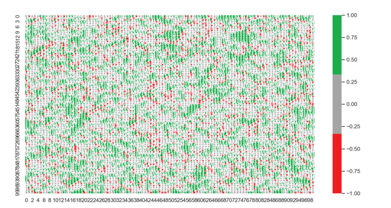
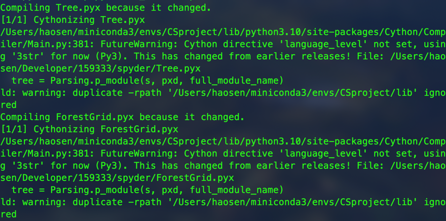

# Modelling Forest Fires by Cellular Automata 🌲🔥
[🏡**Homepage**](https://github.com/Whethe) \
 \

## :thinking: How to run :question:
+ Make sure you have installed Cython
+ Open the root directory in your terminal🖥
+ run `setup.py` by  `python setup.py build_ext --inplace`(macOS) or `python setup.py build_ext --compiler=msvc`(Windows)
+ The result is something like 
+ Run `python main.py`